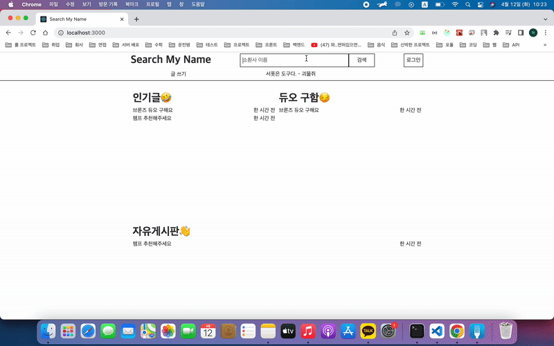
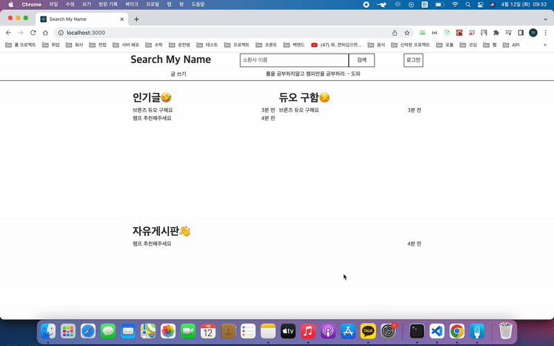
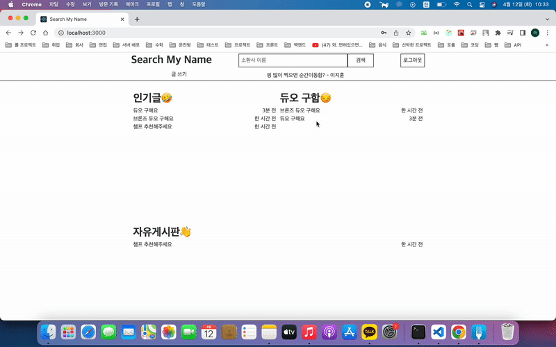
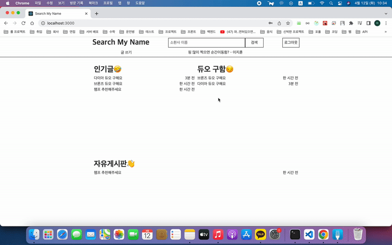

# Search My Name

## 서비스 주소 🛫 \*배포 예정\*

### \*배포는 되었지만, Riot Production API Key가 아직 발급되지 않아 못하고 있습니다.\*

## 기간 2022.01 ~ 진행 중

### 프론트엔드

### What did i do?

#### 1. HTML, CSS 이용해 마크업
#### 2. Media query 이용해 반응형 구현
#### 3. Redux Toolkit으로 마이그레이션
#### 4. Redux Toolkit 이용해 상태 관리
#### 5. Next.js로 마이그레이션

### 백엔드

### What did i do

#### 1. CRUD 구현
#### 2. Riot API 연동
#### 3. JWT 이용해 로그인 구현

## 서비스 소개

### 많은 전적 검색 사이트가 팀 중심으로 데이터를 보여주는 것 같아 플레이어 중심으로 데이터를 보여주면 어떨까? 라는 생각에 시작하게 되었습니다. 비록 지금은 많이 부족하지만 배포 후 꾸준한 업데이트를 통해 더 많은 데이터를 보여줄 예정입니다.

## 기능

## Summoner 검색

## 멀티서치

## POST READ

## POST CREARE

## POST UPDATE

## POST DELETE

